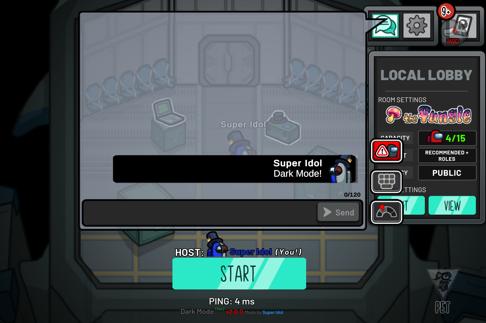

# DarkMode v2.0.0
Tired of straining your eyes with the chat being white? No worries as this mod will turn the chat color to black!

## Note: This is a contnuation of the original repo, due to the owner archiving the repo. I will try my best to keep the mod updated as long as possible. 

   

## Overview

   

## Supported Versions
- ✅ Steam (Supported)
- ✅ itch.io (Supported)
- ✅ Epic Games (Supported)
- ✅ Microsoft Store (Supported)
- ✅ Android (Supported)
- ❌ iOS/iPadOS (Not Supported)
- ❌ Switch/Xbox/Playstation (Not Supported)

## Download & Install!
You can find the latest release here: [Download](https://github.com/superidol1890/DarkModeAU/releases/latest).

## Special Thanks 🙏
* [the-real-techiee](https://github.com/the-real-techiee) for the first 2 builds
* [Gurge44](https://github.com/Gurge44/) for the source codes. [Check his mod out!](https://github.com/Gurge44/EndlessHostRoles)
* PaperSkies for the logo

> This mod is not affiliated with Among Us or Innersloth LLC, and the content contained therein is not endorsed or
> otherwise sponsored by Innersloth LLC. Portions of the materials contained herein are property of Innersloth LLC. ©
> Innersloth LLC.
